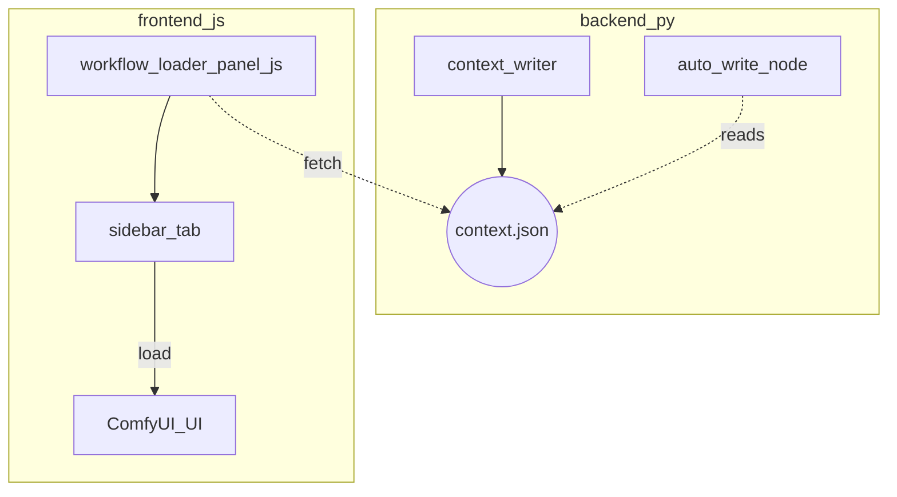

# comfyui-tools

Custom extensions for ComfyUI used by the Redmond3D VFX team.

This repository currently provides:

* **Workflow Loader panel** – a sidebar tab that shows the current production context and lets you open workflow JSON files that follow our pipeline file-path convention.
* **Auto Write node** – a ComfyUI node that writes images to the correct production render directory, building the path from the same context.

---



> Diagram key: `backend_py` = Python side; `frontend_js` = browser side.

---

## 1. Installation

1. Clone or copy this folder into your ComfyUI `custom_nodes/` directory:

```bash
git clone <repo> /path/to/ComfyUI/custom_nodes/comfyui-tools
```

2. (Optional) Drop a `logo.png` into `web/` if you want a custom icon.
3. Restart ComfyUI – the **Workflows** tab will appear on the left and the **Auto Write (prod)** node will be available under category `redmond3d`.

---

## 2. Production context

The extension reads these environment variables at startup:

| Variable | Purpose |
|----------|---------|
| `SHOW`   | Show identifier |
| `SHOT`   | Shot identifier |
| `TASK`   | Department / task (e.g. `comp`) |
| `VERSION`| Version tag (e.g. `v001`) |

`context_writer.py` serialises them (plus resolved paths & workflow list) to `web/runtime/context.json` so the JS panel and nodes can consume the same data without any extra server.

---

## 3. Workflow Loader panel

* **Path template** (edit in `context_writer.py`):

```
/proj/{show}/{shot}/comp/workflows/{task}/{version}
```

* All `*.json` files found in that directory are listed in the panel.
* Clicking a file loads it into ComfyUI (`App.loadGraphFromUrl`).

If you change your directory scheme, tweak the `WORKFLOW_DIR_TEMPLATE` string.

---

## 4. Auto Write node

* **Default path template** (edit in `write_node.py`):

```
/proj/{show}/{shot}/renders/{task}/{version}/{base_name}_{frame:04d}.png
```

* Accepts `images`, `base_name` (string) and optional `path_template` (string).  The template can be overridden per-instance for flexibility.
* Saves all incoming frames, returning a newline-separated list of filepaths.

---

## 5. Custom logo (optional)

1. Place your PNG in `web/logo.png`.
2. In `web/index.js`, update the sidebar registration:

```js
icon: "static/custom_nodes/comfyui-tools/web/logo.png",
```

---

## 6. Development notes

* Static assets under `web/` are served automatically by ComfyUI – no Flask/Django server required.
* All runtime data is written to disk under `web/runtime/` so the browser can `fetch()` it.
* Future nodes or panels can import `context_writer.py` helpers to stay in sync with the production context.

---

Enjoy!  If you run into issues or need enhancements (e.g. version dropdowns, preview thumbnails), open a ticket or ping the tools team.
